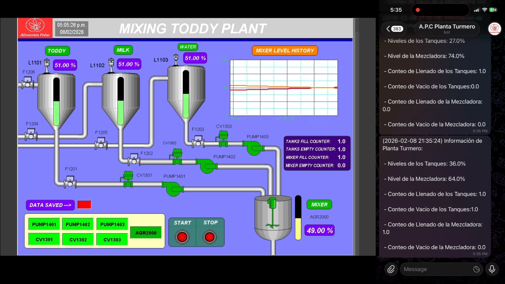
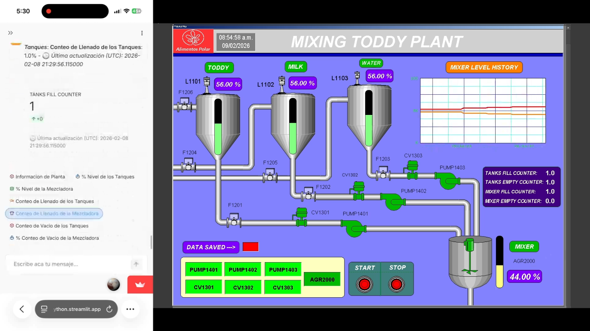

# HMI SCADA PLC Communication with Python AI Agent, Deployed Dashboard and Message Notifications

## Intouch HMI SCADA RSLogix 500 Pro PLC  Communication with Python AI Gemini Agent, Deployed Streamlit Dashboard and Telegram Message Notifications

Intouch HMI SCADA Simulation with PLC RSLogix 500 Pro Communicated with a Gemini Artificial Intelligent Python Agent and a Dashboard Deployed to the Cloud.

The AI Agent and the Streamlit Dashboard has the access of all the variables from the SCADA. The variables are store on a MongoDB Database. Also it has a Message System Notification, Reporting all the Variables of the SCADA to a Smartphone.

## Preview

- Dashboard Preview: [https://youtu.be/v9rbItWB6hI?si=cz3KUaswAU0u8c0C](https://youtu.be/GhQWOAVu0G8?si=kV-HB2r8LAheMfra)

## Connect
- Linkedin: https://www.linkedin.com/in/luis-jose-mendez/
- GitHub: https://github.com/mendez-luisjose
